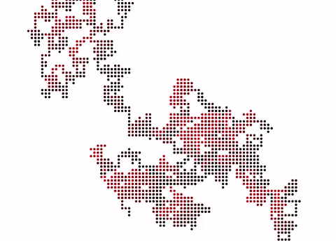
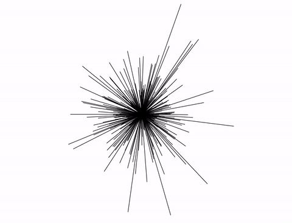

Going through Nature of Code exercises in p5.js. Includes some additional experimentations. To view any of these sketches, replace the second script source file in index.html with the desired p5 sketch.

Below are visuals of the results of these exercises.

 

